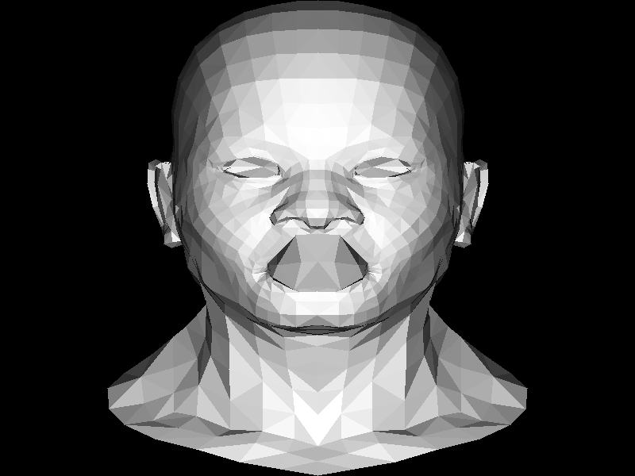

# nimRasterizer

The Beginnings of a humble triangle rasterizer in Nim.

# Status

Draws a boring rectangle...



# Installing
```bash
nimble install sdl2
git clone https://github.com/BracketMaster/nimRasterizer
cd nimRasterizer
nim c src/nimRasterizer
src/nimRasterizer
```

## MacOS Dependencies

```bash
brew install sdl2{,_gfx,_image,_mixer,_net,_ttf}
```

Might have to set ``$DYLD_LIBRARY_PATH`` to where homebrew
SDL2 libraries are contained before running ``src/nimRasterizer``.

For example:

```bash
DYLD_LIBRARY_PATH=/opt/homebrew/lib
src/nimRasterizer
```
